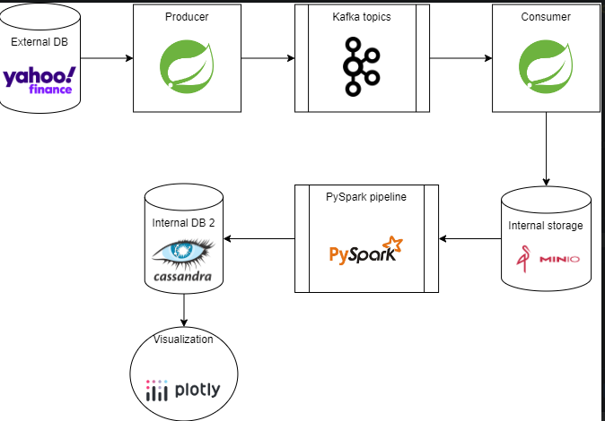

# rpd-project
Distributed computing college project



## Getting Started

To get started with this project, follow the instructions below.

## Prerequisites

- Docker
- Docker Compose
- Git
- Maven
- Java JDK (Java 17)
- Python (3.10)

## Running the app

### Step 1: Clone the Repository
```
git clone https://github.com/KubiakJakub01/rpd-project.git
cd rpd-project
```
### Step 2: Docker Hub Login
```
docker login
```
You will need a security token from https://hub.docker.com/
### Step 3: Run the Cassandra cluster
Create a docker network:
```
docker network create shared-network
```
Run Cassandra cluster:
```
cd cassandra && docker compose up -d
```
It will run 2 Cassandra nodes, one seed node and one regular node. You can check if the cluster is running correctly by running:
```
docker exec -it cassandra-node1 nodetool status
```

### Step 4: Run app
```
docker compose up -d
```
The above command launches 5 docker containers:
- 1 Spring Boot app
- 1 MinIO server
- 1 Kafka broker
- 1 Zookeeper server
- 1 PySpark pipeline and DashBoard app
  
If all services have started correctly you should be able to access the:
- Dashboard app at http://0.0.0.0:8050
- MinIO server at http://172.25.0.2:9000
- PySpark pipeline at http://0.0.0.0:4040


## Verifying Data in MinIO using MinIO Client (mc)
To check if the data is being saved correctly in MinIO, you can use the MinIO Client (mc). If you regularly run docker-compose, you can run the commands below in another terminal, or you can run docker-compose in the background:
```
docker-compose up -d
```
and then run mc in the same terminal
### Prerequisites
spring boot app must be running in the background
### Step 1: Install MinIO Client
Install mc on your local machine:
```
wget https://dl.min.io/client/mc/release/linux-amd64/mc
chmod +x mc
sudo mv mc /usr/local/bin/
```
### Step 2: Configure mc for MinIO
Set up an alias for your MinIO server:
```
mc alias set myminio http://localhost:9000 minioadmin minioadmin
```
### Step 3: List Buckets and Contents
List all buckets:
```
mc ls myminio
```

List the contents of a specific bucket:
```
mc ls myminio/your-bucket-name
```
Currently data is saved to two buckets 'csv-data' and 'realtime-data'

## Creating docker image
### Step 1: Clone the Repository
```
git clone https://github.com/KubiakJakub01/rpd-project.git
cd rpd-project
```
### Step 2: Switch to producer branch
```
git checkout producer
```
### Step 3: Build the Maven Package
```
mvn clean package -Dmaven.test.skip
```
### Step 4: Create a Docker Image
```
docker build -t rpd-spring-boot .
```
### Step 5: Tag created Docker Image
```
sudo docker tag rpd-spring-boot:latest szubidubi/rpd:latest
```
### Step 6: Push to Docker Hub
```
docker login
sudo docker push szubidubi/rpd:latest
```

## Cleaning up

Stop and remove all containers:
```
docker stop $(docker ps -a -q)
docker rm $(docker ps -a -q)
```
Remove network:
```
docker network rm shared-network
```
Remove volumes:
```
docker volume rm cassandra_cassandra-data1
docker volume rm cassandra_cassandra-data2
```
Remove minio data:
```
sudo rm -rf /mnt/data/windows-*-data
```
